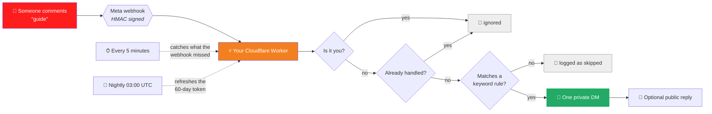

<div align="center">


<p>
  <a href="#quick-start"></a>
  <a href="#roadmap"></a>
  <a href="CONTRIBUTING.md"></a>
</p>

<p>
  <a href="LICENSE"></a>
  <a href="https://github.com/CharanMN7/ig-comment-dm/actions/workflows/ci.yml"></a>
  <a href="https://github.com/CharanMN7/ig-comment-dm/stargazers"></a>
  <a href="https://github.com/CharanMN7/ig-comment-dm/issues"></a>
  
  
  
  
</p>


<br />

**[Quick start](#quick-start) · [How it works](#how-it-works) · [User guide](#user-guide) · [Roadmap](#roadmap) · [Contributing](CONTRIBUTING.md) · [Security](SECURITY.md)**

</div>

---

Someone comments **"guide"** on your reel. They get a DM with your link, automatically, about two seconds later.

That is the entire product. Tools that do this start around **$15/month** and want your Instagram login on their servers. This is the same thing, running on **your** Cloudflare account, on the free tier, for **$0** — and you can read all 4,400 lines of it in an afternoon.

<div align="center">

<a href="https://deploy.workers.cloudflare.com/?url=https://github.com/CharanMN7/ig-comment-dm"></a>
&nbsp;&nbsp;
<a href="#quick-start"></a>

</div>

---

## Why this exists

<table>
<tr>
<th width="34%">&nbsp;</th>
<th width="33%">Hosted tools</th>
<th width="33%">Comment to DM</th>
</tr>
<tr>
<td><b>Cost</b></td>
<td>$15–99 / month, forever</td>
<td><b>$0.</b> Cloudflare's free tier covers 100,000 requests a day.</td>
</tr>
<tr>
<td><b>Your Instagram token</b></td>
<td>On their servers, alongside everyone else's</td>
<td><b>In your Cloudflare account</b>, encrypted with AES-256-GCM using a key only you hold</td>
</tr>
<tr>
<td><b>Your audience's DMs</b></td>
<td>Pass through a third party</td>
<td>Go straight from your Worker to Meta</td>
</tr>
<tr>
<td><b>If they shut down</b></td>
<td>You lose the automation</td>
<td>Nothing changes. It is your Worker.</td>
</tr>
<tr>
<td><b>Rate limits</b></td>
<td>Whatever plan you bought</td>
<td>Meta's actual limits</td>
</tr>
<tr>
<td><b>Reading the code</b></td>
<td>No</td>
<td>4,400 lines. One dependency. No build step.</td>
</tr>
</table>

It uses Meta's official Graph API through Instagram Login. No scraping, no browser automation, and it never sees your Instagram password.

---

## How it works



**Two independent delivery paths.** The webhook is the fast one — a DM lands in about two seconds. The five-minute poll is the safety net, because Instagram quietly drops webhooks for collapsed and low-signal comments. A comment that the webhook missed still gets its DM, just a few minutes later.

Everything lives in one Worker and one SQLite database:

| | |
|---|---|
| **Runtime** | Cloudflare Workers — no servers, no containers, no cold-start cost |
| **Database** | Cloudflare D1 (SQLite) — five tables |
| **Framework** | [Hono](https://hono.dev), server-rendered HTML |
| **Dependencies** | One. Web Crypto does the hashing, HMAC, and AES. |
| **Client-side JS** | None at all |
| **Build step** | None |

---

## Quick start

You need [Node.js 20+](https://nodejs.org), a free [Cloudflare account](https://dash.cloudflare.com/sign-up), and an Instagram **professional** account (Creator or Business — switch in the app under Settings → Account type and tools).

```bash
git clone https://github.com/CharanMN7/ig-comment-dm.git
cd ig-comment-dm
npm install
npx wrangler login

npm run setup
```

`npm run setup` creates the database, generates every secret at the right size, deploys, and finishes by printing the exact strings to paste into Meta's dashboard:

```
[1/6] Checking your Cloudflare login
[2/6] Creating the database and deploying
[3/6] Creating the database tables
[4/6] Your three values from the Meta dashboard
[5/6] Generating the rest
[6/6] Deploying again so the secrets take effect

Done. Your copy is live.
```

It is safe to re-run, and it will not rotate secrets you already have.

> [!IMPORTANT]
> Before that, you need a Meta app — about 15 minutes of clicking, and the part that trips everyone up. **[docs/setup.md](docs/setup.md)** walks through every screen, including the four traps that cost people an evening each.

Stuck? Run **`npm run doctor`**. It checks your live deployment and tells you what is missing in plain words.

<details>
<summary><b>Why clone instead of a template repo?</b></summary>

<br />

Because a fresh clone needs **zero file edits** to deploy — Wrangler provisions the D1 database from the config, so there is no placeholder to fill in. Nothing about the code differs between deployments; the only per-user values are Cloudflare secrets, which never touch the repository.

A GitHub template would sever the upstream link. Meta renames dashboard screens, retires OAuth hosts, and changes signing behaviour often enough that `git pull` needs to keep working:

```bash
git remote add upstream https://github.com/CharanMN7/ig-comment-dm.git
git pull upstream master
npx wrangler deploy
```

Your secrets live in Cloudflare, so updating never touches them.

</details>

---

## User guide

### Connect an account

Open your admin URL (printed by `npm run setup` — bookmark it) and create a password on the first visit. Then **Accounts → Connect a new account**.

You can connect several Instagram accounts to one deployment. Each one needs to be an [Instagram Tester](docs/setup.md#part-2--instagram-tester-invites) on your Meta app.

### Write a rule

**Rules → New rule.**

| Field | What to put |
|---|---|
| **Name** | For you only. `Free guide`. |
| **Keywords** | One per line. **At least 3 characters** — `AI` would fire on "again" and "email". |
| **The DM** | Under 1,000 characters. Put everything they need here. |
| **Public reply** | Optional. Shows under the comment. |
| **Which posts** | All posts and reels, or pick one from the dropdown. |

Matching ignores case, emoji, and punctuation, and matches whole words. A rule scoped to a specific post beats a rule that applies to everything.

> [!TIP]
> **Put everything in that one message.** Instagram allows exactly one private reply per comment, ever. You do not get a follow-up unless they reply to you first.

### Test it without messaging anyone

**Test →** paste a sample comment. It shows which rule would fire. Nothing is sent.

Then comment from a **different** Instagram account — a friend's phone works. Your own comments on your own posts are ignored deliberately.

### Read the Home page

| Panel | What it tells you |
|---|---|
| **Did Instagram reach us?** | Whether Meta is POSTing at all. Empty means the problem is on Meta's side, not yours. `Wrong secret` means `FACEBOOK_APP_SECRET` is missing. |
| **Last 20 sends** | Every DM, skip, and failure, with the reason. |
| **Red banners** | An account needs reconnecting, the nightly job has stalled, or a secret is misconfigured. |

---

## Things that will surprise you

Instagram's rules, not ours. Each of these is enforced by Meta and cost someone an evening to discover.

| | |
|---|---|
| 📨 | **One private message per comment, ever.** A second attempt is blocked here, and Meta would reject it anyway. |
| 🙈 | **Your own comments are ignored.** Meta notifies you about them; acting would DM yourself and burn the one reply. |
| 📅 | **Comments older than 7 days** cannot receive a private reply. They are logged as skipped. |
| 🔑 | **Tokens expire after 60 days.** A nightly job refreshes them. Miss it and the account needs a 20-second reconnect. |
| 🚧 | **A Development-mode app delivers nothing.** Meta only sends the dashboard Test button until you click Publish. This is the number one reason a correct setup does nothing. |
| 🤐 | **Hidden Words eats comments before we see them.** If Instagram's filter hides a comment, it never reaches the API at all. Turn the filter off while testing. |
| ⏳ | **Missed comments arrive late, not never.** The five-minute poll catches them. |

---

## Roadmap

### Shipped

<details open>
<summary><b>Core pipeline</b></summary>

- [x] Comment → one official Instagram private reply, end to end
- [x] Optional public reply under the comment
- [x] Keyword rules with case, emoji, and punctuation normalisation, matched on word boundaries
- [x] Post-scoped rules take priority over account-wide rules
- [x] Reel and post picker, so nobody has to hunt for a Graph media id
- [x] Self-comment guard — never DMs the account owner
- [x] Exactly-once delivery, claimed atomically in the database before sending
- [x] 7-day comment age guard, matching Meta's private-reply window
- [x] Dry-run rule tester that sends nothing to real people

</details>

<details open>
<summary><b>Reliability</b></summary>

- [x] HMAC-verified webhooks, accepting either the Instagram or the Facebook app secret
- [x] Five-minute reconciliation poll for comments the webhook never delivered
- [x] Nightly token refresh with a 10-day lookahead and a reconnect warning
- [x] Automatic `subscribed_apps` registration after Connect
- [x] Retry with jittered backoff on Meta 429s and 5xxs
- [x] Large Instagram ids preserved exactly, instead of being mangled by JSON number parsing
- [x] Inbound webhook log, including rejected signatures, so silence is diagnosable

</details>

<details open>
<summary><b>Security and operations</b></summary>

- [x] Instagram tokens encrypted at rest with AES-256-GCM
- [x] Two-factor admin: a 128-bit secret path plus a password
- [x] Signed, `HttpOnly`, `SameSite=Strict` sessions with CSRF tokens on every form
- [x] `Referrer-Policy: no-referrer` so the secret admin URL never leaks to a third party
- [x] Login rate limiting with a doubling lockout
- [x] Constant-time comparison of the admin path secret
- [x] Startup validation of all eight secrets, surfaced in the admin panel
- [x] `npm run setup` — clone to deployed in one command
- [x] `npm run doctor` — diagnoses a live deployment
- [x] Multi-account support on a single deployment
- [x] Hosted privacy, terms, and data-deletion pages for Meta review

</details>

### Planned

Everything below is [an open issue](https://github.com/CharanMN7/ig-comment-dm/issues). Comment on one to claim it — [`good first issue`](https://github.com/CharanMN7/ig-comment-dm/labels/good%20first%20issue) items are self-contained and have the approach sketched out.

<details open>
<summary><b>🎯 Automation</b></summary>

| | Feature | Why it matters |
|---|---|---|
| ⬜ | **Tracked links with click analytics** | Know whether the DM actually worked, not just that it sent |
| ⬜ | **Button templates in DMs** | A tappable CTA converts far better than a bare URL |
| ⬜ | **Opening DM + reveal on tap** | Works around Meta's one-reply-per-comment limit legitimately |
| ⬜ | **Follow gate** | Deliver the link only after they follow |
| ⬜ | **Follow-up DM after a delay** | A second touch inside the 24-hour window |
| ⬜ | **Reply to DMs and story replies** | The same keyword rules, triggered by inbound messages |
| ⬜ | **`{username}` and `{link}` placeholders** | Personalised copy without a rule per person |
| ⬜ | **Public reply variations** | Rotate replies so a comment section does not read like a bot |
| ⬜ | **Match any comment** | Fire on every comment on a post, no keyword needed |
| ⬜ | **Bind a rule to the next reel you post** | Set the automation up before the content exists |
| ⬜ | **Ad-comment to organic-post mapping** | Boosted posts report a different media id and silently miss |
| ⬜ | **Per-account rate limiting** | Stay under Meta's 750 private replies per hour |
| ⬜ | **Negative keywords** | Skip "not interested", "how much is the guide" |
| ⬜ | **Bulk rule import from CSV** | Set up thirty posts without thirty forms |
| ⬜ | **Rule templates** | Working starting points per niche |

</details>

<details open>
<summary><b>🔤 Matching</b></summary>

| | Feature | Why it matters |
|---|---|---|
| ⬜ | **Non-Latin script matching** | Word-boundary matching silently drops Cyrillic, Arabic, and CJK today |
| ⬜ | **Latin diacritic folding** | `PREÇO` should match a `preco` keyword |
| ⬜ | **Whole-word vs. partial toggle** | Hashtag campaigns need substring matching |

</details>

<details open>
<summary><b>📊 Analytics</b></summary>

| | Feature | Why it matters |
|---|---|---|
| ⬜ | **Dashboard totals** | Sent today, this week, this month, all time |
| ⬜ | **Sends-over-time chart** | Inline SVG, no JavaScript |
| ⬜ | **Per-rule performance** | Which keyword is actually earning its place |
| ⬜ | **Top matched keywords** | What your audience really types |
| ⬜ | **Follower history** | Instagram only keeps 30 days; daily snapshots keep more |
| ⬜ | **Post insights** | Views, reach, saves, and shares next to the sends |
| ⬜ | **Shareable report page** | A read-only link for a client, no login |
| ⬜ | **Filterable, paginated send log** | Twenty rows stops being enough quickly |

</details>

<details open>
<summary><b>🔌 Instagram coverage</b></summary>

| | Feature | Why it matters |
|---|---|---|
| ⬜ | **`messages` webhook field** | Prerequisite for DM triggers and the inbox |
| ⬜ | **DM inbox** | Read replies without leaving the panel |
| ⬜ | **Typed Meta errors** | "Token expired" beats "Graph API error 190" |

</details>

<details open>
<summary><b>🛠 Operations</b></summary>

| | Feature | Why it matters |
|---|---|---|
| ⬜ | **Tracked migration runner** | Adding a migration should not mean editing two npm scripts |
| ⬜ | **Health check endpoint** | Uptime monitoring without a login |
| ⬜ | **Operational event log** | Cron failures are invisible until something breaks |
| ⬜ | **Export rules and logs** | Your data, portable |
| ⬜ | **Dark mode** | The panel is white at 1am |
| ⬜ | **Installable on a phone** | Approve and edit rules from where you actually post |

</details>

<div align="center">

**[→ Browse all open issues](https://github.com/CharanMN7/ig-comment-dm/issues)** · **[→ Good first issues](https://github.com/CharanMN7/ig-comment-dm/labels/good%20first%20issue)**

</div>

---

## Documentation

| | |
|---|---|
| **[docs/setup.md](docs/setup.md)** | Every Meta dashboard screen, and the traps in each |
| **[docs/troubleshooting.md](docs/troubleshooting.md)** | Symptom-first. Start here when nothing happens. |
| **[docs/architecture.md](docs/architecture.md)** | Routes, pipeline, cron, crypto |
| **[CONTRIBUTING.md](CONTRIBUTING.md)** | Setup, house style, what belongs here |
| **[SECURITY.md](SECURITY.md)** | Threat model, secret inventory, rotation, private reporting |

---

## Contributing

Issues and pull requests are welcome. [`good first issue`](https://github.com/CharanMN7/ig-comment-dm/labels/good%20first%20issue) items are self-contained and describe the approach.

```bash
npm install
npm test          # 30 unit tests, no network, no database
npm run typecheck
npm run dev       # http://localhost:8787
```

Read [CONTRIBUTING.md](CONTRIBUTING.md) first — particularly the constraint that keeps this project usable: **one runtime dependency, no build step, no client-side JavaScript.**

Found a security problem? **Do not open an issue.** See [SECURITY.md](SECURITY.md).

---

<div align="center">

### Star history

<a href="https://star-history.com/#CharanMN7/ig-comment-dm&Date"></a>

<br /><br />

**[MIT licensed](LICENSE)** · Built on [Cloudflare Workers](https://workers.cloudflare.com) and [Hono](https://hono.dev)

<sub>Not affiliated with, endorsed by, or sponsored by Meta or Instagram.<br />
Instagram is a trademark of Meta Platforms, Inc.</sub>


</div>
